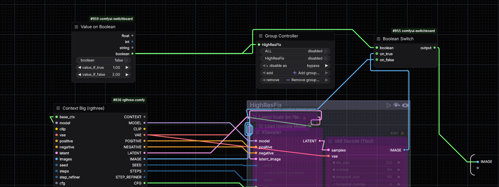

# 🎛️ Switchboard - Advanced Group/Node Controllers for ComfyUI

Nodes for enabling/disabling parts of your graph - by hand or from a wired
boolean. A more flexible take on rgthree's *Fast Group Bypasser*, plus a couple
of boolean utilities so you can build conditional pipelines without any other
pack.

| Node | Targets / does | Add list shows |
|------|----------------|----------------|
| **Group Controller** | toggles groups, by **title** | the group titles in your graph |
| **Node Controller** | toggles individual nodes, by **id** | nodes as `id: Title` |
| **Value on Boolean** | boolean -> one of two values (float/int/string) | - |
| **Boolean Switch** | routes one of two **any-type** inputs, lazily | - |

The two Controllers are client-side (they toggle node modes in the browser); the
two utilities are real backend nodes (they move data at runtime). See
[Bundled boolean utilities](#bundled-boolean-utilities).

## Install

Copy this folder into `ComfyUI/custom_nodes/` (final path
`ComfyUI/custom_nodes/comfyui-switchboard/`), then **restart ComfyUI** and
hard-reload the browser (Ctrl/Cmd+Shift+R). There are **no external Python
dependencies**. The two Controllers are front-end only; the two boolean utilities
are lightweight Python nodes (which is why a server restart is needed, not just a
browser reload). Everything lives under the **🎛️ Switchboard** category in the
Add-Node menu.

---

## Group Controller

Above: a **Boolean** node (`value = true`) is wired into the controller's **`Test`**
input. The controller drives the **`Test`** group on the right (a Save Image
node). Because the boolean is `true`, the group is **enabled**; if it were
`false`, the group would be **muted** (its `↳ disable as` setting).

## Node Controller

Above: the **`ALL`** master toggle is set to **disabled**, yet node **`8: VAE
Decode`** is still **enabled** - because a **Boolean** (`true`) is wired to it.
**A connected boolean overrides the `ALL` broadcast.** This is the key behaviour,
described in full below.

## Putting it together - complex conditional control

Because each controller target is a toggle any `BOOLEAN` can drive, you can route
booleans through the bundled **Value on Boolean** and **Boolean Switch** nodes
into one or more controllers to flip whole sections of a graph from a few inputs.
Above, a **Group Controller** gates several groups while data is routed by a
**Boolean Switch** - including targets **inside a subgraph** - turning a handful
of inputs into a full conditional pipeline. **Every node shown ships in this
pack; no external custom nodes are needed.**

---

## Anatomy of a Controller

From top to bottom, a controller shows:

1. **Input sockets (top of the node).** One `BOOLEAN` socket per controlled
   target, labelled with the target (the group title, or `id: Title` for nodes).
   Wiring is **optional** - see [Boolean inputs](#boolean-inputs). *(Under Nodes
   2.0 the sockets render at the very top of the node, slightly detached from
   their matching toggle row - that's a renderer quirk, not a bug.)*
2. **`ALL`** - the **master broadcast** toggle. Flips every *manually-controlled*
   target on/off at once (see precedence below).
3. **One row pair per target:**
   - **`<target>` toggle** - `enabled` / `disabled` for that target. This is what
     a wired boolean drives.
   - **`↳ disable as`** - `bypass` or `mute`, i.e. *how* that target turns off.
     This stays editable at all times, even while a boolean holds the target on.
4. **`add`** - the **➕ Add group…/node…** dropdown. Pick a target to start
   controlling it. Lists only targets not already controlled.
5. **`remove`** - the **➖ Remove group…/node…** dropdown. Drops a target and
   **re-enables** it (so removing the controller never strands something
   disabled). The right-click menu also has **Remove controlled …** and
   **Refresh … list**.

### What `bypass` vs `mute` do

- **`bypass`** - the target's nodes are bypassed; data routes *around* them and
  the graph still runs.
- **`mute`** - the target's nodes (and everything downstream of them) are muted
  and don't execute at all.

---

## Boolean inputs

Every controlled target has its own `BOOLEAN` input socket. Wiring one is
**optional**.

- **Not wired** → the target is controlled **manually**: its own toggle and the
  `ALL` master toggle.
- **Wired** → the boolean **governs** that target. `True` = `enabled`,
  `False` = `disabled` (turned off using that target's `↳ disable as` mode).

### Precedence - a connected boolean wins

Once a boolean is connected to a target, **it is authoritative for that target's
on/off state and overrides everything else:**

| Action | Target with **no** boolean wired | Target **with** a boolean wired |
|--------|----------------------------------|---------------------------------|
| Click the target's toggle | changes it | reverts to the boolean's value |
| Flip the `ALL` master toggle | changes it | **ignored** - boolean still governs |
| Change `↳ disable as` | takes effect | takes effect (controls *how* it disables) |

This is exactly the **Node Controller** screenshot above: `ALL` is `disabled`,
but `8: VAE Decode` stays `enabled` because its boolean is `true`. Flipping `ALL`
does not touch boolean-governed targets - they only follow their input.

The boolean updates the target **live** as you flip the upstream value, and is
re-read once more **at queue time**, so the prompt that actually runs always
matches the inputs.

### What the boolean reads (and its one limitation)

Enabling/disabling a target changes the **mode** of the underlying node(s) - a
graph operation that happens **before** a prompt is queued. So the controller
reads the upstream boolean's value **in the browser**, by following the wire to
the source node's widget.

- ✅ Works great for **constant** Boolean/primitive nodes (a `True`/`False` you
  set in the UI).
- ❌ Does **not** track a boolean that is *computed at runtime* by another node -
  that value doesn't exist until execution, by which point the target's on/off
  state is already locked for that run. For runtime-computed gating you'd need a
  backend execution-blocking node instead (open an issue if you want that).

---

## Bundled boolean utilities

So you don't need a separate pack (e.g. Comfyroll) to build conditional
pipelines, two small **backend** nodes ship alongside the controllers:

### Value on Boolean
Outputs one of two values depending on a boolean. `boolean = True` returns
`value_if_true`, otherwise `value_if_false` (both set as `FLOAT` widgets on the
node). The same chosen value is emitted on **four outputs** so it can drive
almost any input without a separate convert node:

| Output | Type | What it is | Typical things it controls |
|--------|------|------------|----------------------------|
| `float` | `FLOAT` | the chosen value as-is | CFG, denoise/strength, guidance, LoRA/ControlNet weight, IPAdapter weight - any `FLOAT` input |
| `int` | `INT` | the value rounded to a whole number | steps, seed, width/height, batch size, a switch's select index, loop counts - any `INT` input |
| `string` | `STRING` | the value as text (e.g. `"2.0"`) | filename prefixes, labels, text concat, anything taking a `STRING` |
| `boolean` | `BOOLEAN` | the input boolean, passed through | chain into another node's boolean, a **Boolean Switch**, or a Controller's `BOOLEAN` input - lets one toggle fan out to many places |

So a single toggle can, for example, output `7.0`/`3.5` to set CFG **and**
simultaneously pass its boolean on to flip a Controller - one decision, many
effects. Just connect the output whose type matches the target socket (ComfyUI
shows compatible sockets when you drag a wire).

### Boolean Switch
Routes one of two inputs through based on a boolean: `on_true` when `True`,
`on_false` when `False`. Its `boolean` is an **input socket** (wire a `BOOLEAN`
in - there's no toggle widget, since a switch driven by a hidden widget is easy
to misread). Both data inputs are **any type** (`*`), so it switches images,
latents, models, conditioning - anything. It is **lazy**: only the selected
branch is evaluated, so the unused input's entire upstream chain is **skipped**
(cheaper than switches that compute both sides).

> These are real executing nodes (Python), unlike the controllers. Adding/updating
> them requires a **ComfyUI server restart**, not just a browser reload. They live
> under the same **🎛️ Switchboard** category.

---

## Notes

- **Node Controller targets by id.** Nodes are matched by their stable id, so
  retitling a controlled node still works; the `id: Title` label is captured when
  you add it. Controllers can't target other controllers.
- **Survives save/load.** All state lives in node properties and is re-applied at
  queue time. Older saved Group Controllers are auto-migrated to the current
  format.
- **Subgraph-aware.** A controller operates on the graph it sits in, so a
  controller placed inside a subgraph targets that subgraph's own groups/nodes
  (and its `Add…` list shows those, not the outer graph's). To drive an
  in-subgraph controller from outside, expose a `BOOLEAN` as a **subgraph input**
  and wire your boolean to it - the controller traces that input back across the
  subgraph boundary to read the value (so only the boolean crosses; the
  controller keeps holding the inner node/group id). Nested subgraphs work too.
  To switch a **whole** subgraph instead, target the subgraph node itself with a
  Node Controller from the parent graph.

## Nodes 2.0 compatibility

The two **Controllers** are client-side (virtual) nodes built on the legacy
LiteGraph API - the same class of node as rgthree's group tools. (The **Value on
Boolean** and **Boolean Switch** utilities are ordinary backend nodes and aren't
affected by any of this.) ComfyUI's **Nodes 2.0** (Vue renderer) is currently
opt-in and keeps a compatibility layer, so the Controllers load and function
there (toggles, booleans and queue-time apply all work). Caveats for the
Controllers:

- The **core action** (setting nodes to active/bypass/mute) is graph data, not
  rendering - it works regardless of renderer.
- The **UI** uses legacy patterns (virtual node, dynamic widgets/inputs, context
  menu) that 2.0 may render inconsistently - e.g. input sockets float to the top
  of the node, and links to dynamically-added sockets may draw as straight lines
  instead of curves. These are cosmetic. Canvas-draw hooks are deliberately
  avoided (a timer replaces `onDrawForeground`) so live input tracking keeps
  working.

A Vue/V3-native rewrite would be the longer-term fix once those APIs are
documented.
